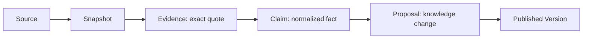

# LogiSpace 0.3 深度研究 Agent：设计与代码评审手册

> 文档性质：架构说明书 + 源码走读 + 真实任务复盘 + 改进路线图  
> 对应版本：LogiSpace 0.3 当前实现  
> 评审对象：`plan → search → summarize → deposit` 深度研究链路

## 1. 结论先行

LogiSpace 0.3 已经具备一条真实可运行的深度研究链路。它不是一个自由发挥的“聊天 Agent”，而是一个**由固定状态机约束的研究编排器**：系统先识别作品并盘点已有知识，再生成 WorkDossier Plan；用户批准后，系统受控搜索、抓取、检索、抽取证据、验证主张，最后同时生成可读报告与可入库知识包，并经人工审核后发布新版本。

当前实现的核心价值是“可追溯”：任何准备入库的知识都必须经过 `Source → Snapshot → Evidence → Claim → Proposal`。它已经能跑通框架，但研究质量仍主要受三个瓶颈限制：来源广度不足、报告写作仍偏模板化、知识实体对齐较粗。因此，下一阶段不应该推翻链路，而应分别增强 Search、Writer 和 Curator，同时保留现有证据门禁。

## 2. 产品目标与边界

### 2.1 用户真正需要的交付物

一次深度研究不是只交付一段回答，而要形成两类长期资产：

1. **人读报告**：结构清晰、叙述连贯、能解释作品、能定位依据。
2. **机器可入库知识包**：作品档案、人物与关系、叙事时间线、诡计集、杀人方法集，以及每项内容的证据与置信状态。

### 2.2 Agent 的职责边界

| 环节 | 必须完成 | 不应越界 |
|---|---|---|
| Plan | 识别知识缺口、拆成可验证问题、分配预算和风险 | 不提前写结论，不把猜测当事实 |
| Search | 找到足以回答问题且来源类型互补的材料 | 不以搜索摘要代替正文，不无限扩张主题 |
| Summarize | 从快照中抽取原文证据，形成可核验主张，再写报告 | 不引用不存在的段落，不掩盖冲突和证据不足 |
| Deposit | 将已验证主张映射为稳定知识实体和变更提案 | 不自动覆盖既有版本，不把报告语言直接当结构化事实 |

### 2.3 作品创建的交互原则

新作品默认只要求用户输入**作品名与类型**。只有当检索发现多个作者、年份或版本候选时，才进入身份确认；唯一候选则自动继续。这能把正常路径保持在最短，同时防止同名作品、改编版和译本污染知识库。

## 3. 总体架构


架构选择的关键不是“多少个 Agent”，而是职责是否隔离。当前代码以单个编排器驱动多个确定性组件和两次模型调用，能够保证状态、预算和证据规则统一。未来可以把 Planner、Researcher、Writer、Curator 拆成独立执行单元，但它们仍应共享同一份作业状态与证据账本。

## 4. 全链路设计

### 4.1 Resolve Identity：先确定研究对象

目的：建立稳定的 `work_id`，避免同名作品、不同媒介或不同版本互相污染。

输入只包含名称与作品类型。输出分两种：唯一身份直接创建研究作业；出现多个作者、年份或版本候选时暂停并请求确认。身份确认只解决“研究哪个对象”，不在这一阶段展开内容研究。

### 4.2 Inventory / Coverage：先看库里有什么

目的：避免重复研究，并把已有知识和缺口变成计划的约束条件。

Coverage 至少覆盖基本信息、人物、关系、时间线、诡计、杀人方法、来源与证据。每个板块记录覆盖率、已知项、缺失项、冲突项和风险等级。高风险板块——尤其凶手、手法、关键诡计——需要更严格的多源规则。

### 4.3 Plan：把“研究作品”拆成可验收任务

WorkDossier Plan 不是关键词列表，而是研究合同。每个 PlanItem 应明确：

- 要回答的问题；
- 目标知识板块；
- 建议查询词和来源类型；
- 最低证据数量；
- 完成判据与停止条件；
- 预算和优先级。

当前 `make_plan()` 依据 Coverage 生成固定结构计划，优点是稳定可测试；缺点是对作品类型和库内缺口的适配仍有限。理想状态是“确定性骨架 + 模型补充问题”，模型只能在 schema 和预算内扩展。

### 4.4 Search：受控发现，而不是漫游

Search 的目标是为 PlanItem 找到可抓取、可引用、相互独立的材料。目前实现使用 DuckDuckGo HTML 搜索，Wikipedia 作为回退，并做本地相关度评分。搜索必须受三类边界控制：

- **范围边界**：查询必须归属于某个 PlanItem；
- **预算边界**：查询数、URL 数、抓取字节数和模型 token 数有上限；
- **来源边界**：优先正文可访问、出处明确、能够形成独立证据的页面。

当前最大问题是“找到一个能用的来源就足以跑通，却不足以称为深度”。下一步应加入来源配额：百科/官方资料、出版社或权威书目、学术与评论材料至少覆盖两类；高风险主张必须由两个独立域名支持。

### 4.5 Fetch / Snapshot：冻结研究现场

抓取后的正文不是临时上下文，而是研究审计材料。系统应保留 URL、标题、抓取时间、正文哈希、解析器版本与不可变文本。后续 Evidence 必须指向 Snapshot 中可重新定位的原文片段。

当前 HTML 清洗器足以处理简单页面，但对脚注、分页、动态页面和正文识别较弱。应逐步引入正文抽取质量评分，并保留原始响应摘要或对象存储引用。

### 4.6 Retrieve：只把相关片段交给模型

系统按段落切块，使用英文 token 与中文二元词组建立 BM25 排序，把每个研究问题最相关的片段交给抽取器。这样既节省 token，也降低模型在整篇文档中自由联想的空间。

检索结果应作为一等审计对象：记录查询、候选 chunk、排序分数和最终入选集合。当前实现能够排序，但这些中间结果还没有完整持久化，导致研究效果难以离线复盘。

### 4.7 Evidence → Claim：事实门禁

Evidence 是来源中的原文片段；Claim 是系统根据一个或多个 Evidence 形成的规范化陈述。二者不能合并：原文可能措辞杂乱，Claim 需要稳定语义；但 Claim 又必须能回溯原文。

当前抽取器要求模型返回严格 JSON，并验证引用必须是 chunk 的连续子串。随后第二次模型调用审核 Claims。涉及凶手、作案方法和核心诡计的高风险主张，只有在至少两个独立来源支持时才能标记为 `supported`；否则必须保留为证据不足或待审核。



### 4.8 Report Writer：为人组织论证

报告不是 Claims 的列表。它应包含研究范围、版本说明、人物与关系、事件与叙事时间、诡计机制、杀人方法、冲突与不确定性、来源说明。每个关键结论要关联 Evidence，剧透内容要显式标记。

当前 `build_report()` 按板块确定性分组，保证可重复生成，但语言更像数据投影。下一步应增加一个受约束的 Writer：输入只能是已验证 Claims 与引用，输出采用章节 schema；生成后再运行 citation validator，任何无法对齐 Claim ID 的句子不得作为事实段落发布。

### 4.9 Knowledge Curator：为机器建立稳定结构

Curator 将 Claims 映射为五类核心资产：

- 作品档案；
- 人物及人物关系；
- 叙事时间线；
- 诡计集；
- 杀人方法集。

入库前要解决实体对齐、重复合并、时间语义、剧透等级、证据引用和版本差异。当前 `build_package()` 已能输出上述集合，但人物别名、关系方向、故事时间与叙事披露时间仍需更精细的模型和规则。

### 4.10 Review / Publish：人类掌握最终写权

系统先形成 Proposals，而不是直接覆盖知识库。用户可以查看报告、知识包、证据、Claims 和变更提案，审核后才发布新版本。发布过程写入版本目录并更新 manifest，使每次研究都可回滚、可比较。

## 5. 状态机与失败语义

推荐把状态机视为产品协议，而不仅是后端枚举：

```text
CREATED → PLANNED → AWAITING_APPROVAL → SEARCHING → FETCHING
        → EXTRACTING → VERIFYING → SYNTHESIZING → PROPOSING
        → AWAITING_REVIEW → PUBLISHED
```

旁路状态包括 `PAUSED`、`FAILED`、`CANCELLED`。暂停和重试必须从已持久化检查点继续，不能默默重跑并产生不同 Proposal；每次迁移应写事件，包含旧状态、新状态、原因、时间和执行者。

当前实现存在多个直接状态赋值，尚未集中到统一 transition guard。建议新增 `transition(job, event)`：校验允许路径、写事件、更新 lease，并对外发出 SSE。这样可以消除非法跳转和难以复现的并发问题。

## 6. 源码地图

| 关注点 | 代码入口 | 阅读重点 |
|---|---|---|
| 研究编排 | `apps/api/app/services/research_v3.py` | `create()`、`approve()`、`run()`、`review()`、`publish()` |
| 抽取与验证 | `apps/api/app/services/research_extractor.py` | 严格 JSON、原文连续子串、高风险多源门禁 |
| 报告与知识包 | `apps/api/app/services/research_synthesis.py` | `build_report()` 与 `build_package()` 的职责差异 |
| 搜索提供器 | `apps/api/app/services/search_providers.py` | DuckDuckGo、Wikipedia 回退、本地评分 |
| 检索 | `apps/api/app/services/retrieval.py` | chunk 策略、中文二元词、BM25 |
| 持久化 | `apps/api/app/services/research_repository.py` | 作业保存、恢复、事件流 |
| API 路由 | `apps/api/app/routes/research_v3.py` | 计划批准、研究产物、审核发布、暂停重试 |
| 领域模型 | `packages/domain/logispace_domain/models_v3.py` | Job、Plan、Evidence、Claim、Proposal、知识包 schema |
| Worker | `apps/api/app/worker.py` | 后台执行入口与 inline worker 切换 |

### 6.1 编排器走读

`ResearchServiceV3.create()` 建立 Job、生成 Coverage 和 Plan，然后停在批准边界。`approve()` 接收计划决定并派发执行。`run()` 依次完成搜索、抓取、切块检索、抽取验证和合成，写入每阶段产物。`review()` 记录提案审核，`publish()` 生成新版本并写入 dossier、report、knowledge-package。

这个类当前同时承担状态机、流程编排、预算、持久化和发布，适合原型但不利于演化。应保留它作为 Application Service，把具体阶段抽成带显式输入输出的 Step：`PlanStep`、`SearchStep`、`AcquireStep`、`ExtractStep`、`VerifyStep`、`SynthesizeStep`、`DepositStep`。

### 6.2 Extractor 走读

`extract()` 接收检索片段与计划上下文，调用模型生成 Evidence 和 Claims；服务端不信任模型提供的 quote，而会重新检查它是否真实存在于 chunk。`verify()` 对候选 Claim 再做一次核验并应用多源规则。

这是当前系统最重要的安全边界。后续优化 Prompt 时，不应删除服务端引用校验。还应增加：规范化 URL 域名、同源转载识别、Evidence 去重、数字/人名一致性检查、Prompt 版本与模型参数入账。

### 6.3 Synthesizer 走读

`build_report()` 为人类读者组织章节；`build_package()` 为知识库组织实体。这两个输出共享 Claims，却有不同质量标准，因此保持分离是正确设计。报告允许解释性连接句，知识包则必须结构严格、字段稳定、可以幂等合并。

### 6.4 Repository 与 API 走读

Repository 将 Job 与事件持久化，使 HTTP 请求不必承载完整执行过程。API 把“批准计划”和“审核提案”设为两个明确的人机边界，并分别暴露 coverage、sources、evidence、claims、report、knowledge package 与 proposals，便于前端逐层解释研究结果。

## 7. 一次真实任务如何运行

已完成任务 `research_98f898d7aebc` 研究《罗杰疑案》，以知识库 `0.1.0` 为基线，发布为 `0.2.0`。

| 指标 | 实际结果 |
|---|---:|
| 搜索查询 | 5 |
| 有效来源 | 1 |
| Evidence | 13 |
| Claims | 9 |
| Proposals | 9 |
| 模型调用 | 2 |
| Token | 18,517 |
| 报告章节 | 3 |
| 人物 / 关系 | 3 / 6 |
| 时间线事件 | 4 |
| 诡计 / 杀人方法 | 4 / 1 |

发布产物位于：

- `data/works/murder-of-roger-ackroyd/versions/0.2.0/dossier.json`
- `data/works/murder-of-roger-ackroyd/versions/0.2.0/report.json`
- `data/works/murder-of-roger-ackroyd/versions/0.2.0/knowledge-package.json`

这次运行证明端到端链路是真实的：搜索、模型抽取、证据验证、报告与知识包生成、审核发布都留下了产物。但它也直接暴露了质量问题：只有一个有效来源，无法充分满足高风险结论的独立交叉验证。因此应把“成功运行”和“达到深度研究质量门槛”区分开。Job 可以执行成功，但 Coverage Gate 应允许标记 `insufficient_sources`，阻止高风险内容自动成为 supported。

## 8. Prompt 与模型调用策略

当前正确方向是让模型处理语义密集、规则难以完全编码的部分，让程序处理预算、引用、状态和写入：

| 工作 | 适合模型 | 适合确定性代码 |
|---|---|---|
| 补充研究问题 | 是，但受 Plan schema 限制 | 预算、必备板块、停止条件 |
| 搜索词扩展 | 是 | 域名过滤、去重、配额 |
| Evidence/Claim 抽取 | 是 | quote 连续子串校验、ID、去重 |
| Claim 核验 | 是 | 多源计数、风险门禁 |
| 报告写作 | 是 | 只允许引用已验证 Claim、引用完整性检查 |
| 知识映射 | 是，尤其实体对齐 | schema、版本合并、幂等性 |
| 发布 | 否 | 全部由事务和版本规则执行 |

每个模型调用应记录 `prompt_version`、模型、参数、输入 Evidence/Claim ID、输出哈希、token、耗时和错误。Prompt 应作为版本化资产，而不是散落在 Python 字符串中。

## 9. 当前实现与目标设计的差距

| 优先级 | 差距 | 风险 | 建议修改入口 |
|---|---|---|---|
| P0 | 来源多样性和独立性不足 | 高风险知识可能只有单一依据 | `search_providers.py`、Coverage Gate |
| P0 | Claim 仍可能以通用实体方式沉淀 | 语义和证据关系易丢失 | 领域模型、版本 dossier schema |
| P0 | 状态迁移未集中管理 | 重试/并发时可能非法跳转 | `research_v3.py`、Repository |
| P1 | 报告是模板投影，不是高质量叙述 | 可读性达不到最终产品目标 | `research_synthesis.py` 新增受约束 Writer |
| P1 | 实体对齐、别名和关系方向较粗 | 人物关系重复或含混 | Knowledge Curator + canonical ID |
| P1 | 时间线未充分区分故事时间与披露时间 | 叙事诡计表达不准确 | Timeline schema |
| P1 | 检索中间结果未完整入账 | 无法评价召回、定位漏证 | RetrievalSet / Chunk 持久化 |
| P2 | HTML 正文抽取较简单 | 噪音页面降低抽取质量 | Fetcher / parser adapter |
| P2 | SSE 更接近事件快照 | 长任务进度体验和恢复性有限 | durable event stream |
| P2 | Worker lease 与数据库迁移不完整 | 多实例运行风险 | Worker、Repository、Alembic |
| P2 | 存在遗留 `search_urls()` 路径 | 维护与行为分叉 | 删除或合并到 Provider |

## 10. 推荐的演进架构

不建议立刻引入一群自由协作的 Agent。推荐先把当前单体流程拆成七个**可重放步骤**，每步只读上一阶段产物、写自己的产物：

```text
ResearchOrchestrator
  ├─ IdentityStep        -> WorkIdentity
  ├─ PlanningStep        -> ResearchPlan
  ├─ SearchStep          -> SearchRun + Source candidates
  ├─ AcquisitionStep     -> Snapshots + DocumentChunks
  ├─ ExtractionStep      -> Evidence + CandidateClaims
  ├─ VerificationStep    -> VerifiedClaims + conflicts
  ├─ SynthesisStep       -> Report + KnowledgePackage + Proposals
  └─ DepositStep         -> immutable WorkVersion
```

每步应满足：输入输出 schema 固定、带版本号；可以独立重试；预算可测量；执行日志可查询；不修改其他阶段产物。等这些边界稳定后，再将语义任务替换为更强模型或独立 Agent，系统不会因 Agent 自由度增加而失去审计性。

## 11. 分阶段改进计划

### 阶段 A：让“深度”可度量

1. 引入 `SourcePolicy` 和独立域名计数。
2. 为每个 PlanItem 增加最低来源数、最低 Evidence 数和风险门槛。
3. 持久化 SearchRun、DocumentChunk、RetrievalSet。
4. 输出 Coverage Gate 失败原因，而不是笼统成功/失败。

验收：一个高风险 Claim 若只有单一来源，即使模型认可也不能标为 supported；研究页能解释还缺什么。

### 阶段 B：提升报告可读性

1. 新增受约束 Report Writer 模型调用。
2. 按“结论—解释—证据—不确定性”写章节。
3. 增加 citation validator 和无依据句检测。
4. 支持剧透层级与简版/完整版报告。

验收：报告不再是字段堆叠，所有事实句都能回到 Claim ID，所有 Claim 都能回到 Evidence。

### 阶段 C：提升知识库质量

1. 为 Person、Relationship、TimelineEvent、Trick、MurderMethod 建立正式 schema。
2. 实现 canonical entity ID、别名、关系方向和合并策略。
3. 时间线同时表达故事发生时间、叙述顺序和揭示顺序。
4. Proposal 展示新增、修改、冲突、拒绝原因与影响范围。

验收：重复研究同一作品不会制造重复人物；版本差异可解释；被拒绝的提案不会污染正式知识。

### 阶段 D：强化工程运行

1. 集中状态转换和幂等键。
2. 增加 Worker lease、超时回收与阶段检查点。
3. 使用 Alembic 管理 SQLite/PostgreSQL schema。
4. 建立 golden task：固定作品、固定快照、固定质量指标。

验收：任一阶段崩溃后可从检查点继续；同一任务重复投递不会重复发布；离线评测可比较 Prompt 或模型升级前后的质量。

## 12. 评审时应重点追问的问题

1. Planner 的完成标准是否能被程序判断，还是只是一句自然语言？
2. Search 是否覆盖了互相独立的来源类型，还是多个页面实际转载同一材料？
3. 每个关键事实是否有精确 Evidence，而不是仅有 URL？
4. Claim 是来源明确陈述，还是模型根据常识补全？
5. 报告中的事实句能否全部映射到 Claim？
6. 人物关系和时间线是否区分事实、推断与叙述技巧？
7. Knowledge Package 是否能幂等写入、版本比较和回滚？
8. 失败、暂停、重试是否保持相同输入和可解释结果？
9. 预算耗尽时，系统能否明确指出哪些板块仍不完整？
10. 用户审核的是可理解的变化，还是难以判断的一堆 JSON？

## 13. 最终判断

现有计划可以满足“先搭一个真实可运行框架”的目标，也已经证明可以从作品输入走到版本发布。但若目标升级为稳定的高质量深度研究，下一轮工作的重心应是：

1. **让搜索真正多源并可度量**；
2. **让 Writer 在证据约束下写出可读报告**；
3. **让 Curator 产生可长期维护的知识实体**；
4. **让每一步可重放、可评测、可解释**。

保留固定状态工作流、WorkDossier Plan、受控搜索和 Evidence → Claim → Proposal，是正确的底座。要优化的是各阶段的质量契约，而不是把系统改造成不可控的自由 Agent 群。

