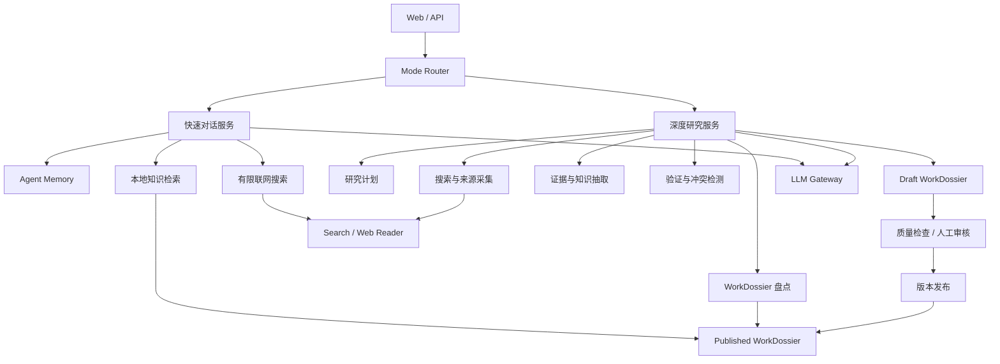
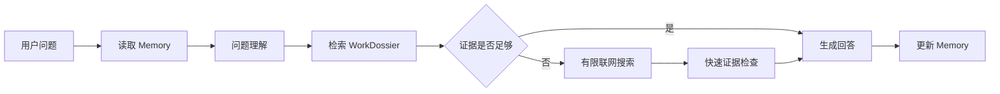

# LogiSpace 0.2 技术方案

## 1. 文档信息

- 版本：0.2 Draft
- 产品阶段：Agent 驱动的快速问答与作品深度研究
- 基线版本：LogiSpace 0.1
- 核心知识资产：`WorkDossier`

## 2. 版本目标

0.2 不再依赖写死的问答内容，而是引入大模型和搜索工具，形成两个边界明确的功能：

1. **快速对话**：优先检索本地知识库，必要时进行有限联网搜索，快速、准确地回答问题；通过 Agent Memory 支持多轮对话，但不修改正式知识库。
2. **深度研究**：以作品及其具体版本为单位，系统性搜索、阅读、抽取和验证资料，最终创建或升级标准化的 `WorkDossier`。

核心原则：

> 快速对话消费知识，深度研究生产知识；Agent Memory 保证对话连续，WorkDossier 保证作品知识长期稳定。

## 3. 非目标

0.2 暂不追求：

- 完全自主、无边界的通用 Agent；
- 让快速对话自动修改正式知识库；
- 每个用户问题都触发完整作品研究；
- 使用聊天记录代替结构化知识库；
- 将所有网页全文永久保存为知识；
- 一开始引入复杂的多 Agent 分布式系统；
- 用图数据库替代当前全部数据模型；
- 无人工检查地自动发布高风险知识。

## 4. 总体架构



架构采用“一个编排层 + 多个结构化步骤”，不要求每个步骤都是独立 Agent。所有模型输出必须通过 Pydantic Schema 验证后才能进入后续流程。

## 5. 功能一：快速对话

### 5.1 产品承诺

- 秒级响应；
- 支持多轮上下文；
- 优先使用已发布的 WorkDossier；
- 本地知识不足时进行小规模联网搜索；
- 关键事实提供引用；
- 无充分信息时拒答或说明不确定性；
- 不产生正式知识库变更。

### 5.2 处理链路



### 5.3 问题理解输出

模型将问题转换为结构化 `QueryIntent`：

```json
{
  "mode": "chat",
  "question_type": "character_relationship",
  "work_candidates": ["devotion-of-suspect-x"],
  "media_scope": "novel",
  "target_entities": ["石神哲哉", "花冈靖子"],
  "spoiler_level": "full",
  "needs_clarification": false,
  "search_queries": []
}
```

问题理解必须处理：

- 作品名、译名和别名；
- 小说、电影、剧集等版本；
- 人物和其他实体；
- 多轮指代；
- 比较、因果、时间线等问题类型；
- 用户允许的剧透级别；
- 是否需要澄清。

### 5.4 本地检索

本地检索采用混合策略：

1. `work_id`、版本、实体类型、剧透级别等结构化过滤；
2. 标题、别名和实体名称的关键词检索；
3. Claim、Evidence 和摘要的向量检索；
4. 根据实体关系进行一到两跳扩展；
5. 按相关性、证据质量、来源质量和版本一致性重排。

本地检索结果应返回知识单元，而不是直接返回完整页面文本：

```json
{
  "claim_id": "claim_xxx",
  "text": "……",
  "support_status": "supported",
  "evidence_ids": ["evidence_xxx"],
  "work_id": "devotion-of-suspect-x",
  "spoiler_level": "full",
  "score": 0.91
}
```

### 5.5 联网搜索边界

快速对话的联网搜索必须受限：

- 默认最多两轮搜索；
- 默认最多读取三到五个有效来源；
- 只围绕当前问题，不扩展研究整部作品；
- 优先官方、出版社、作者访谈和高可信资料；
- 搜索结果摘要不能直接作为事实证据；
- 找不到可靠证据时明确说明；
- 联网结果只进入会话和短期缓存，不进入 WorkDossier。

### 5.6 Agent Memory

Memory 分为三层。

#### 当前会话状态

- 当前作品及版本；
- 当前人物和主题；
- 用户剧透权限；
- 尚未解决的问题；
- 最近使用的来源。

#### 压缩会话摘要

- 已确认的上下文；
- 已回答问题；
- 重要指代关系；
- 用户后续可能继续追问的主题。

#### 用户长期偏好

- 默认语言；
- 回答深度；
- 默认剧透级别；
- 常用媒体版本。

Memory 不保存：

- 大量网页全文；
- 未验证的模型推测；
- 可以从 WorkDossier 重新检索的完整知识；
- 无限增长的完整聊天历史。

### 5.7 快速对话输出

```json
{
  "conversation_id": "conv_xxx",
  "answer": "……",
  "answer_status": "supported",
  "citations": [],
  "used_work_ids": [],
  "used_web_search": true,
  "uncertainties": [],
  "suggest_deep_research": false
}
```

`answer_status` 建议包括：

- `supported`
- `partial`
- `inferred`
- `conflicted`
- `insufficient`

## 6. 功能二：深度研究

### 6.1 产品承诺

- 以作品及具体媒体版本为研究单位；
- 先盘点已有 WorkDossier，再进行增量研究；
- 使用多轮、分主题的系统搜索；
- 关键知识具有来源和证据；
- 最终产出符合统一 Schema 的 WorkDossier；
- 支持草稿、质量检查、审核、发布和回滚。

### 6.2 研究任务输入

```json
{
  "work_identity": {
    "canonical_title": "嫌疑人X的献身",
    "original_title": "容疑者Xの献身",
    "creator": "东野圭吾",
    "media_type": "novel",
    "release_year": 2005,
    "edition_scope": "original_novel"
  },
  "research_scope": "incremental_full",
  "base_dossier_version": "0.1.0",
  "spoiler_level": "full",
  "budget": {
    "max_search_rounds": 12,
    "max_sources": 40,
    "max_model_tokens": 300000
  }
}
```

作品身份没有确认前，不允许进入正式研究阶段。

### 6.3 研究状态机

```text
created
  → identifying
  → inventorying
  → planning
  → collecting
  → extracting
  → verifying
  → drafting
  → quality_check
  → needs_review
  → published
```

异常状态：

```text
needs_clarification
paused
budget_exhausted
conflicted
failed
rejected
```

每个阶段必须持久化输入、输出、耗时、模型用量、错误和重试次数，任务可以暂停和恢复。

### 6.4 已有知识盘点

深度研究首先分析基线 WorkDossier：

- 已有实体和别名；
- 已有关系；
- 三轨时间线完整度；
- 已有线索、证词、诡计和解答；
- Claim 的证据覆盖；
- 来源质量和时效性；
- 冲突和未解决问题；
- 上一个版本的 revision notes。

盘点结果把知识分为：

- `retain`：可靠且完整；
- `strengthen`：结论基本可靠，需要补充证据；
- `revise`：发现冲突或版本错误；
- `missing`：知识库尚未覆盖。

研究计划优先处理 `revise` 和 `missing`，避免重复研究已经可靠的部分。

### 6.5 标准研究目录

Agent 的搜索方式可以灵活，但最终内容必须映射到统一目录：

1. 作品身份、版本与别名；
2. 无剧透简介；
3. 登场人物；
4. 人物关系；
5. 地点与关键物品；
6. 真实事件时间线；
7. 犯罪实施时间线；
8. 调查时间线；
9. 叙事与揭示时间线；
10. 线索；
11. 证词；
12. 犯罪实施过程；
13. 杀人手法；
14. 核心诡计；
15. 误导机制；
16. 解答和推理链；
17. 主题与创作背景；
18. 改编版本差异；
19. 争议解释；
20. 来源与证据。

每个目录项具有覆盖状态：

- `not_started`
- `in_progress`
- `sufficient`
- `partial`
- `not_applicable`
- `conflicted`

### 6.6 搜索和采集策略

搜索分为四步：

1. **来源发现**：生成多语言查询，发现候选来源；
2. **来源筛选**：根据来源类型、作者、完整性和相关性评分；
3. **正文阅读**：打开原始页面或文档，保留定位信息；
4. **缺口驱动搜索**：根据当前覆盖情况继续搜索未满足的目录项。

来源优先级建议：

1. 原作文本或用户合法提供的资料；
2. 作者、出版社和版权方官方资料；
3. 作者或主创访谈；
4. 权威书目和专业研究；
5. 高质量长篇评论；
6. 普通媒体和读者分析；
7. 聚合页、无出处内容和搜索摘要仅作线索。

研究停止条件：

- 所有必需目录达到 `sufficient` 或明确标记 `partial`；
- 关键 Claim 均有可定位证据；
- 新一轮搜索不再产生有效新增信息；
- 达到预算上限；
- 出现必须由用户处理的版本或版权问题。

### 6.7 证据和知识抽取

Agent 首先抽取来源和证据，再生成知识，不允许从答案文本反向生成证据。

```text
SourceDocument
  → EvidenceItem
    → Claim
      → Entity / Relation / TimelineEvent / Trick / SolutionModel
```

每个 Claim 必须记录：

- Claim 文本；
- 类型；
- 所属作品和媒体版本；
- Evidence ID；
- 支持状态；
- 置信度；
- 剧透级别；
- 事实、推断或解释；
- 创建来源和研究任务。

### 6.8 验证规则

确定性规则负责：

- Schema 校验；
- ID 唯一性；
- 引用是否存在；
- 关系两端实体是否存在；
- 时间格式和顺序；
- 作品版本一致性；
- 剧透级别完整性；
- Dossier 版本递增；
- 重复实体和重复关系检查。

模型负责：

- 引用是否真正支持 Claim；
- 多个来源是否在讨论同一事实；
- 评论观点是否被误写为作品事实；
- 不同版本内容是否混淆；
- 来源之间是否存在语义冲突；
- 时间线或推理链是否存在逻辑缺口。

重要结论建议至少满足：

- 一个高可信一手或官方来源；或
- 两个相互独立的可信二手来源。

无法达到门槛时标记 `partial`、`inferred` 或 `conflicted`，不能伪装成确定事实。

### 6.9 WorkDossier 发布

研究过程中生成 `Draft WorkDossier`，不覆盖已发布版本。

```text
Published 0.1.0
  → Research Job
  → Draft 0.2.0
  → Quality Check
  → Review
  → Published 0.2.0
```

发布记录必须包含：

- 基线版本；
- 新版本；
- 新增、修改和删除项；
- 新增来源与证据；
- 已解决的知识缺口；
- 仍未解决的问题；
- 研究任务 ID；
- 模型和提示词版本；
- Token、时间和搜索用量；
- 审核人和发布时间。

## 7. 快速对话与深度研究的关系

两者共享底层能力，但拥有不同的写权限和质量标准。

### 7.1 共享能力

- LLM Gateway；
- 作品识别与实体消歧；
- 本地混合检索；
- 搜索和网页读取适配器；
- 来源质量评分；
- 引用格式化；
- 剧透策略；
- Token 和成本统计；
- 日志和可观测性。

### 7.2 权限边界

| 行为 | 快速对话 | 深度研究 |
|---|---:|---:|
| 读取 Published WorkDossier | 是 | 是 |
| 读取 Agent Memory | 是 | 可选 |
| 联网搜索 | 有限 | 系统性 |
| 写入会话记录 | 是 | 仅任务交流 |
| 写入短期搜索缓存 | 是 | 是 |
| 创建知识候选 | 否 | 是 |
| 创建 Draft WorkDossier | 否 | 是 |
| 发布 WorkDossier | 否 | 审核后 |

### 7.3 模式升级

以下情况快速对话应建议用户启动深度研究：

- 用户要求完整分析整部作品；
- 需要覆盖多个知识目录；
- 需要比较多个版本；
- 本地知识不足且有限搜索无法可靠回答；
- 用户明确希望把结果加入知识库；
- 当前作品尚未建立 WorkDossier；
- 已有 Dossier 被判定为明显不完整或存在冲突。

模式升级必须由用户明确触发，不应在后台悄悄启动高成本研究。

## 8. 大模型 API

### 8.1 0.2 是否必须使用大模型 API

是。0.2 的核心目标需要调用大模型 API。仅靠关键词和规则无法可靠完成：

- 自然语言问题理解；
- 多轮指代解析；
- 搜索计划生成；
- 搜索查询改写；
- 长文阅读和证据抽取；
- 实体、关系和时间线抽取；
- Claim 与证据的语义验证；
- 冲突检测；
- 基于多来源的回答生成；
- WorkDossier 草稿生成。

如果没有大模型 API，0.2 只能继续停留在固定意图和固定模板阶段。

### 8.2 不应交给模型的工作

以下能力应由普通代码和数据库保证：

- 任务状态机；
- WorkDossier 版本号；
- 数据库存取；
- 权限控制；
- Schema 校验；
- ID 和引用完整性；
- 去重的基础规则；
- Token 和预算限制；
- 超时、重试和幂等；
- 发布、审核和回滚；
- 搜索结果缓存；
- 审计日志。

原则是：

> 模型负责语义判断和内容理解，系统代码负责状态、约束、权限和一致性。

### 8.3 LLM Gateway

业务代码不直接调用特定厂商 SDK，而是通过统一网关：

```python
class LLMGateway:
    def generate_structured(self, task, messages, schema, model_policy):
        ...

    def generate_text(self, task, messages, model_policy):
        ...

    def embed(self, texts, embedding_policy):
        ...
```

网关负责：

- 模型供应商适配；
- 模型选择；
- 结构化输出；
- 超时和重试；
- 限流；
- Token 统计；
- 成本记录；
- 日志脱敏；
- 提示词版本；
- 降级策略；
- 测试时使用 Mock Provider。

### 8.4 模型分层

不建议所有步骤都调用最高能力模型。

| 任务 | 模型策略 |
|---|---|
| 简单意图分类、查询改写 | 快速低成本模型 |
| 会话摘要 | 快速低成本模型 |
| 快速回答 | 中等能力低延迟模型 |
| 研究计划 | 高能力推理模型 |
| 长文证据抽取 | 支持长上下文的模型 |
| Claim 验证和冲突检测 | 高能力推理模型 |
| Dossier 综合与质量检查 | 高能力推理模型 |
| 向量检索 | Embedding 模型 |

具体供应商和模型名称通过配置决定，不写死在业务逻辑中。

### 8.5 API Key 与安全

- API Key 仅保存在后端环境变量或密钥管理系统；
- 浏览器前端不得直接持有模型或搜索服务密钥；
- 日志不记录完整密钥、用户私密内容和受版权保护的全文；
- 对发送给第三方模型的内容执行最小化和脱敏；
- 用户上传文件需要明确授权后才能发给外部模型；
- 每个研究任务记录实际调用的提供商和数据策略。

## 9. 数据模型增量

0.2 建议新增以下核心对象。

### 9.1 Conversation

```json
{
  "conversation_id": "conv_xxx",
  "user_id": "user_xxx",
  "active_work_id": "work_xxx",
  "spoiler_level": "full",
  "summary": "……",
  "created_at": "……",
  "updated_at": "……"
}
```

### 9.2 Message

```json
{
  "message_id": "msg_xxx",
  "conversation_id": "conv_xxx",
  "role": "user",
  "content": "……",
  "citations": [],
  "created_at": "……"
}
```

### 9.3 ResearchJob

```json
{
  "job_id": "job_xxx",
  "work_id": "work_xxx",
  "media_scope": "novel",
  "base_version": "0.1.0",
  "target_version": "0.2.0",
  "status": "collecting",
  "research_scope": "incremental_full",
  "budget": {},
  "usage": {},
  "created_at": "……"
}
```

### 9.4 ResearchCoverage

```json
{
  "job_id": "job_xxx",
  "section": "timeline_investigation",
  "status": "partial",
  "knowledge_gaps": ["……"],
  "supporting_claim_ids": []
}
```

### 9.5 KnowledgeProposal

```json
{
  "proposal_id": "proposal_xxx",
  "job_id": "job_xxx",
  "operation": "add_relation",
  "target_path": "relations",
  "payload": {},
  "evidence_ids": [],
  "confidence": 0.92,
  "review_status": "pending"
}
```

### 9.6 DossierVersion

```json
{
  "work_id": "work_xxx",
  "version": "0.2.0",
  "base_version": "0.1.0",
  "status": "draft",
  "artifact_path": "……",
  "quality_score": 0.87,
  "revision_notes": [],
  "published_at": null
}
```

## 10. API 草案

### 10.1 快速对话

```text
POST   /conversations
GET    /conversations/{conversation_id}
POST   /conversations/{conversation_id}/messages
DELETE /conversations/{conversation_id}/memory
```

`POST /messages` 支持流式返回：

```text
intent → local_retrieval → web_search → answering → completed
```

### 10.2 深度研究

```text
POST /research/jobs
GET  /research/jobs/{job_id}
POST /research/jobs/{job_id}/pause
POST /research/jobs/{job_id}/resume
POST /research/jobs/{job_id}/cancel
GET  /research/jobs/{job_id}/coverage
GET  /research/jobs/{job_id}/sources
GET  /research/jobs/{job_id}/proposals
GET  /research/jobs/{job_id}/draft
POST /research/jobs/{job_id}/review
POST /research/jobs/{job_id}/publish
```

### 10.3 WorkDossier

```text
GET /works/{work_id}/dossiers
GET /works/{work_id}/dossiers/{version}
GET /works/{work_id}/dossiers/{version}/diff
POST /works/{work_id}/dossiers/{version}/rollback
```

## 11. 存储设计

### PostgreSQL

存储：

- 用户、会话和消息；
- Agent Memory；
- Research Job 和阶段状态；
- SourceDocument 元数据；
- Evidence、Claim 和 KnowledgeProposal；
- Dossier 版本、审核和发布记录；
- Token、成本和审计日志。

### 对象存储或本地文件存储

存储：

- 网页快照；
- 用户上传资料；
- 解析后的长文；
- Draft 和 Published WorkDossier JSON；
- 研究过程生成的中间产物。

### 检索索引

0.2 可以先使用 PostgreSQL 全文检索和 `pgvector`：

- 关键词检索负责精确名称和术语；
- 向量检索负责语义相关性；
- 结构化字段负责作品、版本和剧透过滤。

暂时不强制引入独立图数据库。

## 12. 可观测性和成本

每次模型或搜索调用至少记录：

- trace ID；
- conversation ID 或 job ID；
- 阶段；
- 模型和提示词版本；
- 输入、输出 Token；
- 延迟；
- 重试次数；
- 估算成本；
- 结构化输出是否通过验证；
- 是否触发降级；
- 来源数量和有效证据数量。

深度研究应显示预算：

```json
{
  "search_rounds": {"used": 6, "limit": 12},
  "sources": {"used": 21, "limit": 40},
  "model_tokens": {"used": 128000, "limit": 300000},
  "estimated_cost": 4.82
}
```

“Token 利用最大化”的衡量标准不是总消耗，而是：

- 每千 Token 产生的有效 Evidence 数量；
- 每千 Token 产生的受支持 Claim 数量；
- 新增或增强的 WorkDossier 字段数量；
- 重复来源和重复结论占比；
- 人工审核通过率。

## 13. 评测方案

### 13.1 快速对话评测

- 作品识别准确率；
- 多轮指代准确率；
- 本地知识命中率；
- 无关答案率；
- 知识库外问题拒答准确率；
- 引用支持率；
- 剧透泄漏率；
- 首 Token 延迟和总响应时间；
- 单次问答平均成本。

### 13.2 深度研究评测

- 标准目录覆盖率；
- Claim 证据覆盖率；
- 引用定位有效率；
- 实体和关系重复率；
- 媒体版本混淆率；
- 冲突发现率；
- Dossier Schema 通过率；
- 人工审核通过率；
- 相同作品重复研究比例；
- 增量研究对旧知识的复用率；
- 单部作品研究时间和成本。

### 13.3 必测场景

- 知识库内简单事实；
- 知识库外简单事实；
- 同名作品消歧；
- 小说与电影版本差异；
- 多轮“他/这个诡计/上一部”指代；
- 有意诱导模型编造的问题；
- 来源相互冲突；
- 研究任务中断与恢复；
- 同一作品重复发起研究；
- Draft 审核、发布和回滚；
- 不同剧透级别下的回答。

## 14. 实施计划

### Phase 1：LLM 与检索基础

- 实现 LLM Gateway；
- 接入一个模型供应商；
- 建立结构化输出和重试；
- 扩展 Source、Evidence 和 Claim 数据模型；
- 建立 PostgreSQL 全文和向量检索；
- 将现有 WorkDossier 建立检索索引。

### Phase 2：快速对话闭环

- Conversation 和 Message；
- QueryIntent；
- 多轮 Agent Memory；
- 本地混合检索；
- 有限联网搜索；
- 引用、拒答和不确定性；
- 流式回答；
- 快速对话评测集。

### Phase 3：深度研究执行器

- ResearchJob 状态机；
- 作品身份确认；
- 已有 Dossier 盘点；
- 固定研究目录和覆盖状态；
- 搜索计划和缺口驱动搜索；
- 来源采集与正文读取；
- 中断、恢复、预算和幂等。

### Phase 4：知识生产和发布

- Evidence 和 Claim 抽取；
- 实体、关系和时间线标准化；
- 冲突检测；
- KnowledgeProposal；
- Draft WorkDossier；
- 质量检查；
- 审核、diff、发布和回滚。

### Phase 5：评测和优化

- 建立快速对话与深度研究 Golden Set；
- 分阶段模型选择；
- 缓存和来源复用；
- Token 和成本优化；
- 提示词、Schema 和阈值迭代；
- 研究完成度与质量仪表板。

## 15. 0.2 最小可交付范围

建议 0.2 首个可测试版本只覆盖：

### 快速对话

- 一条真实的多轮会话；
- 本地检索优先；
- 本地不足时有限联网；
- 带来源回答；
- Agent Memory；
- 无证据拒答；
- 不写正式知识库。

### 深度研究

- 用户选择一部作品；
- 确认作品及媒体版本；
- 盘点已有 WorkDossier；
- 执行增量研究；
- 生成真实 Source、Evidence 和 Claim；
- 生成 Draft WorkDossier；
- 人工确认后发布新版本。

成功验收应证明：

1. 快速对话能够连续回答，并且不会污染正式知识库；
2. 第一次深度研究能够从真实来源生成标准 WorkDossier；
3. 同一作品再次研究时能够复用旧知识，只补充缺口；
4. 发布后的知识能在下一次快速对话中被直接检索使用；
5. 所有正式知识都能追溯到来源和证据。

## 16. 关键架构决策

1. 0.2 必须使用大模型 API，但通过统一 LLM Gateway 接入。
2. 快速对话和深度研究共享底层工具，不共享知识写权限。
3. 快速对话的联网内容是临时研究结果，不进入正式知识库。
4. WorkDossier 是正式作品知识的唯一发布单元。
5. 深度研究默认是基于现有 Dossier 的增量研究。
6. 搜索过程允许灵活，最终产物必须符合固定 Schema。
7. 模型负责语义，确定性代码负责状态、权限和一致性。
8. 高风险知识在 0.2 阶段经过审核后才能发布。
9. Token 优化以有效知识产出为目标，而不是以消耗量为目标。
10. 在评测证明可靠之前，不允许 Agent 自动覆盖 Published WorkDossier。
